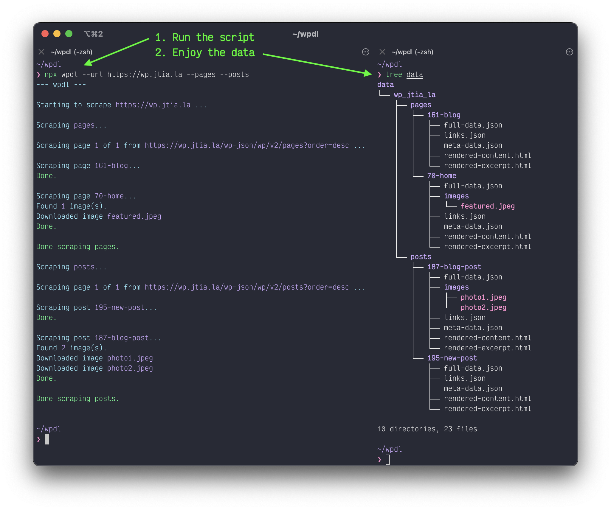

# wpdl

[](https://github.com/jtiala/wpdl/blob/main/LICENSE)
[](https://github.com/jtiala/wpdl/releases)
[](https://www.npmjs.com/package/wpdl)
[](https://conventionalcommits.org)
[](https://github.com/jtiala/wpdl/actions/workflows/ci.yml)

Scrape pages, posts, images and other data from a WordPress instance using the WordPress [REST API](https://developer.wordpress.org/rest-api/). Use simple command line arguments to clean up the scraped data.



## Pre-requisites

Node.js v19 or newer (for native fetch support)

## Installation

```bash
npm i
```

## Usage examples

Scrape pages and posts

```bash
npm run scrape -- --url https://your-wp-instance.com --pages --posts
```

Scrape pages and clean up the html by filtering out all `img` elements and elements with the class `foo`. Also remove all elements without text content. From the json files, remove all the Jetpack and Yoast SEO data.

```bash
npm run scrape -- --url https://your-wp-instance.com --pages --elementFilter img --classFilter foo --jsonFilter "jetpack_*" --jsonFilter "yoast_*" --removeEmptyElements
```

To see full usage, run

```bash
npm run help
```
